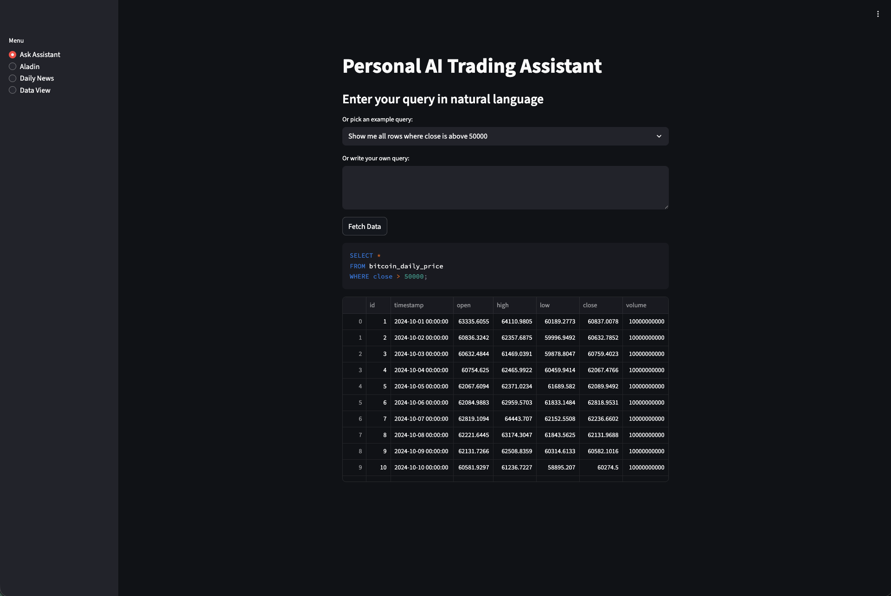

# Personal AI Trading Assistant



## Demo Website
This website is deployed and live via AWS
[Click here to view the demo](http://13.231.121.59:8501/)

Please note that the site may occasionally lag / crash as it has been hosted on free tier of AWS with very low compute

## Features
- **OHLC Data Viewer**: Visualize Bitcoin OHLC data with filtering options.
- **Daily News**: Stay updated with the latest Bitcoin-related news.
- **AI Assistant**: Query Bitcoin data using natural language.
- **Price Prediction**: Predict the next day's Bitcoin closing price using a Random Forest model.

### CommitDiff (For HW)


### Build Success (For HW)


## Detailed Documentation

This repository includes additional documentation for specific aspects of the project:

1. **[EDA.md](readme/EDA.md)**: Provides insights into the exploratory data analysis (EDA) of the Bitcoin dataset. It includes benchmarking results, feature engineering techniques, and visualizations of price and volume trends.
2. **[TEST.md](readme/TEST.md)**: Describes the testing framework used in the project. It covers pytest fixtures, test categories, and instructions for running unit and system tests.
3. **[DATASET.md](readme/DATASET.md)**: Details the Bitcoin dataset used in the project, including its structure, size, and instructions for loading it into various DataFrame libraries like Pandas, Polars, and PySpark.
4. **[ENV_SETUP.md](readme/ENV_SETUP.md)**: Explains how to set up the development environment using Dev Containers or Docker. It ensures a reproducible and isolated environment for development and testing.
5. **[CODE_FEATURES.md](readme/CODE_FEATURES.md)**: Highlights the key features of the codebase, such as data loading, EDA, feature engineering, dataset preparation, and model evaluation. It also includes example usage for each module.
6. **[GIT_ACTIONS.md](readme/GIT_ACTIONS.md)**: Documents the GitHub Actions workflows for CI/CD. It explains the steps for Docker image building, deployment to AWS EC2, and code sanity checks.

## How to Run
1. Clone the repository:
   ```bash
   git clone https://github.com/Kedar-V/IDS-706-DataEngineering.git
   ```
2. Navigate to the project directory:
   ```bash
   cd IDS-706-DataEngineering
   ```
3. Build and run the Docker containers:
   ```bash
   docker compose up -d
   ```
4. Access the app at [http://localhost:8501](http://localhost:8501).

## Folder Structure
```
IDS-706-DataEngineering
├── Week1
├── Week2
│   ├── Bitcoin_DataAnalysis.py
│   ├── assets
│   │   ├── benchmark.png
│   │   ├── candles.png
│   │   ├── output.png
│   │   ├── priceTrend.png
│   │   └── volumeTrend.png
├── Week3
├── Week4
│   ├── app
│   │   ├── server
│   │   ├── worker
│   │   ├── dao
│   │   ├── data
│   │   └── model
├── docker-compose.yml
├── Dockerfile
└── README.md
```

## License
This project is licensed under the MIT License.

