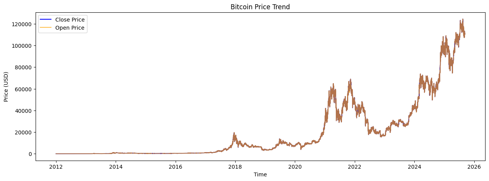
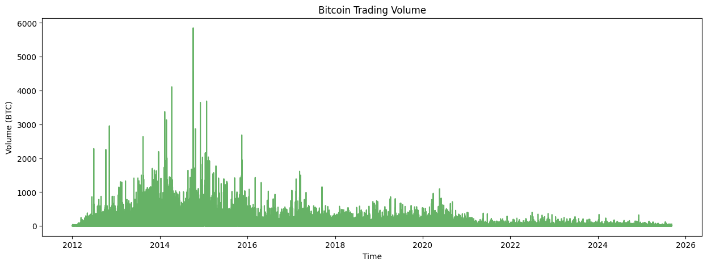
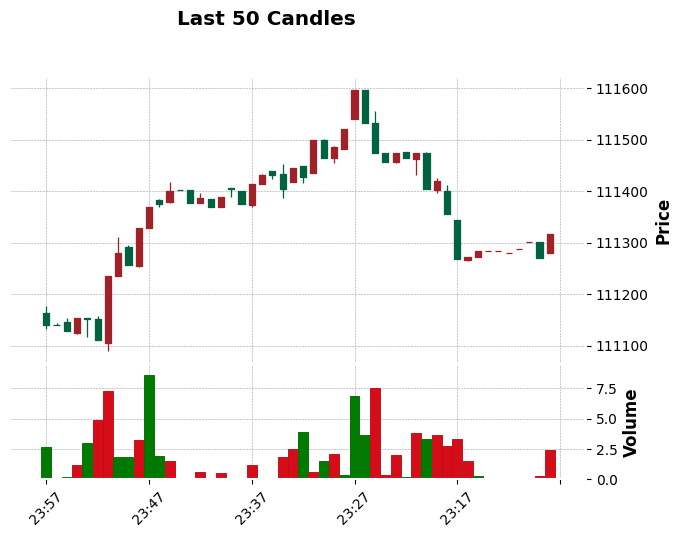
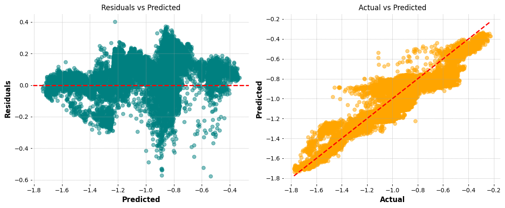

# IDS-706-DataEngineering-Week3
# Index

# Index

- [Project Structure](#project-structure)
- [Environment Setup](#environment-setup)
  - [Dev Container (VS Code)](#dev-container-vs-code)
  - [Docker Container](#docker-container)
- [Bitcoin ML Pipeline](#bitcoin-ml-pipeline)
  - [Supported DataFrame Libraries](#supported-dataframe-libraries)
  - [Dataset](#dataset)
  - [Installation and Setup](#installation-and-setup)
  - [Features](#features)
    - [1. DataFrameLoader](#1-dataframeloader)
    - [Benchmarking](#benchmarking)
    - [2. CryptoEDA](#2-cryptoeda)
    - [3. CryptoFeatureEngineer](#3-cryptofeatureengineer)
    - [4. CryptoDatasetLoader](#4-cryptodatasetloader)
    - [5. Model Training](#5-model-training)
    - [6. ModelEvaluator](#6-modelevaluator)
- [Results](#results)
  - [Improvements and Future Work](#improvements-and-future-work)
  - [Detailed Results and Visualizations](#detailed-results-and-visualizations)
- [Bitcoin Data Analysis Testing](#bitcoin-data-analysis-testing)
  - [Key Python Modules](#key-python-modules)
  - [Pytest Fixtures](#pytest-fixtures)
  - [Test Overview](#test-overview)
- [How to Run Tests](#how-to-run-tests)
  - [1. Using Python directly](#1-using-python-directly)
  - [2. Using Makefile](#2-using-makefile)


---
# Project Structure
```
├── .devcontainer
├── Week1/
├── Week2/
│   └── Bitcoin_DataAnalysis.py
├── Week3/
│   ├── test_BitcoinDataAnalysis.py
│   └── requirements.txt
├── Dockerfile
├── docker-compose.yml
└── README.md
```


- **Week2/Bitcoin_DataAnalysis.py**: Contains the main classes for data loading, feature engineering, dataset preparation, and model evaluation.
- **Week3/test_BitcoinDataAnalysis.py**: Contains unit tests and system tests.
- **requirements.txt**: Python dependencies for Week3.
- **Dockerfile / docker-compose.yml**: Optional containerized environment for reproducible testing.
- **.devcontainer/**: Contains VS Code Dev Container configuration for a reproducible development environment.

---

# Environment Setup

## Dev Container (VS Code)

This project provides a **Dev Container** configuration for reproducible development and testing using VS Code. You can run all tests and Python scripts in a containerized environment without polluting your local machine.

### Steps to Use Dev Container

1. **Install VS Code Extensions**  
   Make sure you have the following installed in VS Code:
   - **Remote - Containers**  
     (Official extension to work with Dev Containers)

2. **Open the Project in VS Code**  
   - Open the folder containing this repository in VS Code.

3. **Open in Dev Container**  
   - Press `F1` → type `Remote-Containers: Open Folder in Container` → select the project folder.  
   - VS Code will build the container using the included `devcontainer.json` and `Dockerfile`.

4. **Post-create Commands**  
   - The Dev Container automatically installs dependencies from `Week3/requirements.txt`.

5. **Run Tests Inside Container**  
   Open a terminal inside VS Code (within the container) and run:

   ```bash
   cd Week3
   pytest -vv --cov=Bitcoin_DataAnalysis test_BitcoinDataAnalysis.py
    ```
---

## Docker Container

This project can also be run using a **Docker container** without relying on VS Code Dev Containers. This ensures a reproducible Python environment on any system with Docker installed.

### Steps to Use Docker Container

1. **Install Docker**  
   Ensure Docker is installed and running:

   ```bash
   docker --version
   ```
2. Build the Docker Image from the project root:
    ```bash
    docker build -t python_week3 .
    ```
    This uses the Dockerfile to create a container with Python 3.12 and dependencies from Week3/requirements.txt.

3. Run the Container
    ```bash
    docker run -it --name python_week3 -v $(pwd):/app python_week3
    ```

- `-v $(pwd):/app` mounts the project folder into the container.  
- It opens an interactive terminal.

4. To enter the running container, use:  
    ```bash
    docker exec -it python_week3 /bin/bash
    ```

5. Alternative: Using Docker Compose

    You can also use docker-compose for easier management:
    ```bash
    docker-compose up -d
    ```
    - This builds and starts the container in detached mode.

    Access the container with:

    ```bash
    docker compose exec python /bin/bash
    ```

# Bitcoin ML Pipeline

This repository provides a complete workflow for working with cryptocurrency OHLCV (Open, High, Low, Close, Volume) datasets. It covers data loading, exploratory data analysis (EDA), feature engineering, dataset preparation for machine learning, model training, and evaluation.

**Supported DataFrame Libraries:**  
You can load and process your data using any of the following frameworks:
- **Pandas** (for traditional in-memory analysis)
- **Polars** (for fast, multi-threaded DataFrame operations)
- **PySpark** (for distributed processing and large-scale data)

This flexibility allows you to choose the best tool for your dataset

---

## Table of Contents
- [Installation and Setup](#installation-and-setup)
- [Dataset](#dataset)
- [Features](#features)
  - [Data Loading](#1-dataframeloader)
  - [Benchmarking](#benchmarking)
  - [Exploratory Data Analysis](#2-cryptoeda)
  - [Feature Engineering](#3-cryptofeatureengineer)
  - [Dataset Loader](#4-cryptodatasetloader)
  - [Model Training](#5-model-training)
  - [Model Evaluation](#6-modelevaluator)
- [Results](#results)
    - [Improvements and Future Work](#improvements-and-future-work)
    - [Detailed Results and Visualizations](#detailed-results-and-visualizations)
---
## Dataset

This project uses the [Bitcoin Historical Data](https://www.kaggle.com/datasets/mczielinski/bitcoin-historical-data/data) from Kaggle.

- **Format:** CSV, OHLCV (Open, High, Low, Close, Volume) at 1-minute intervals
- **Size:** ~350MB (over 2 million rows)
- **Columns:** Timestamp (epoch seconds), Open, High, Low, Close, Volume

You can download the dataset directly from Kaggle and place it in your project directory.  
For instructions on loading the dataset into Pandas, Polars, or PySpark, refer to the [DataFrameLoader](#1-dataframeloader) section below and see usage examples in the notebook: [Bitcoin_DataAnalysis.ipynb](./Bitcoin_DataAnalysis.ipynb)

---
## Installation and Setup

Install all required Python packages:

```bash
pip install -r requirements.txt
```

Or, manually install the main dependencies:

```bash
pip install pandas polars pyspark pyspark-connect matplotlib mplfinance seaborn scikit-learn
```

For PySpark with Hadoop 3 support (if needed):

```bash
PYSPARK_HADOOP_VERSION=3 pip install pyspark
```

Start a Spark session in your notebook or script:

```python
from pyspark.sql import SparkSession

spark = SparkSession.builder.appName("Bitcoin_DataAnalysis").getOrCreate()
```
---
## Features

### 1. DataFrameLoader

- Load CSV datasets into Pandas, Polars, or PySpark.
- Ensures Timestamp remains in epoch seconds for consistency.
- Benchmarks performance of basic operations (read, filter, groupby).
- Includes plots comparing speed across frameworks.

**Example Usage:**
```python
from Week2.Bitcoin_DataAnalysis import DataFrameLoader

csv_file_path = "btcusd_1-min_data.csv"
loader = DataFrameLoader(csv_file_path)

# Load as Pandas DataFrame
df_pd = loader.load('pandas')

# Load as Polars DataFrame
df_pl = loader.load('polars')

# Load as PySpark DataFrame
df_spark = loader.load('pyspark')
```

### Benchmarking

The notebook includes a benchmarking suite that compares the performance of Pandas, Polars, and PySpark for common data operations on the Bitcoin dataset:

- **CSV Read Time:** Measures how quickly each library loads the dataset.
- **Head Operation:** Time to fetch the first few rows.
- **Filtering:** Time to filter rows where Close price > 50,000.
- **GroupBy Mean:** Time to group by year and compute mean Close price.

Results are visualized as bar plots for each operation.  
**Findings:**  
For datasets of approximately 350MB, Polars and Pandas are significantly faster than PySpark, which incurs additional overhead due to its distributed nature. PySpark is recommended only for much larger datasets or distributed environments.

You can run the benchmark using:
```python
benchmark_results = loader.benchmark()
print("Benchmark results (in seconds):")
for lib, results in benchmark_results.items():
    print(lib, results)
```

### 2. CryptoEDA

- Overview of dataset (shape, summary statistics).
- Price and volume trend plots.
- Returns calculation and distribution plots.
- Rolling volatility visualization.
- Correlation heatmaps of numerical features.
- Candlestick chart previews.
- One-click `run_all` method to execute all EDA steps.

**Example Usage:**
```python
from Week2.Bitcoin_DataAnalysis import CryptoEDA

# Load your Polars DataFrame (see DataFrameLoader above)
df = loader.load('polars')

# Initialize EDA
eda = CryptoEDA(df)

# Run all EDA steps (overview, plots, volatility, correlation, candlestick)
eda.run_all(recent_seconds=3600, vol_window=60, candlestick_rows=50)

# Or run individual steps
eda.overview()
eda.plot_price_trend()
eda.plot_volume_trend()
eda.add_returns()
eda.plot_returns_distribution()
eda.add_rolling_volatility(window=60)
eda.plot_rolling_volatility(window=60)
eda.plot_correlation_heatmap()
eda.plot_candlestick(last_n=50)
```
### Few Interesting Observations
#### Bitcoin Price Trend Insights

Over the past decade, Bitcoin has exhibited a remarkable and steady increase in price, punctuated by periods of high volatility and rapid growth. The long-term trend highlights Bitcoin's transition from a niche digital asset to a mainstream financial instrument, with notable surges during major adoption events and market cycles.

The chart below visualizes the historical price trend, showcasing the overall upward trajectory despite short-term fluctuations:



#### Bitcoin Volume Trend Insights

The historical volume trend for Bitcoin trading exhibits a bell-shaped curve, with notable peaks occurring between 2014 and 2017. This period corresponds to increased market activity and growing interest in cryptocurrencies, leading to higher trading volumes. After 2017, trading volume stabilized, reflecting Bitcoin's maturation as a financial asset.

The chart below illustrates the volume trend:




#### Recent Candle Trend Insights (Last 50 Candles)

Analysis of the last 50 candles provides a snapshot of short-term market sentiment and price action. Key observations include:

- **Bullish Candles:** Periods where the closing price is higher than the opening price, indicating upward momentum.
- **Bearish Candles:** Periods where the closing price is lower than the opening price, signaling downward movement.
- **Long Wicks:** Candles with long upper or lower shadows suggest volatility and potential reversals.
- **Doji Patterns:** Candles with small bodies and long wicks, reflecting market indecision.

The candlestick chart below visualizes the last 50 candles, highlighting recent price swings, volatility, and potential support/resistance levels:



### 3. CryptoFeatureEngineer

- Adds financial features for predictive modeling:
    - Returns, spreads, candle shapes
    - Lag features
    - Rolling statistics (SMA, EMA, volatility, ATR)
    - RSI, MACD, Bollinger Bands
- Returns a Polars DataFrame enriched with technical indicators.


**Example Usage:**
```python
from Week2.Bitcoin_DataAnalysis import CryptoFeatureEngineer

# Load your Polars DataFrame (see DataFrameLoader above)
df = loader.load('polars')

# Initialize feature engineer
fe = CryptoFeatureEngineer(df)

# Add features step-by-step or chain methods
df_feat = (
    fe.basic_features()
      .lag_features()
      .rolling_features()
      .rsi()
      .macd()
      .bollinger_bands()
      .get_df()
)

# View last few rows with new features
print(df_feat.tail(10).to_pandas())
```

### 4. CryptoDatasetLoader

- Prepares features and target for machine learning:
    - Target = next-period Close price
    - Null handling and filtering
    - Optional scaling with StandardScaler
    - Optional PCA for dimensionality reduction
    - Train/test split support
    - Option to restrict to last N rows for experiments
    - PCA variance plots for diagnostics

**Example Usage:**
```python
from Week2.Bitcoin_DataAnalysis import CryptoDatasetLoader

# Use engineered features from CryptoFeatureEngineer
dataloader = CryptoDatasetLoader(
    df_feat,
    target_col="Close",
    scale=True,
    apply_pca=True,
    pca_variance=0.95,
    subset_size=100000   # only use last 100,000 rows
)

# Create target and filter nulls
dataloader.create_target().filter_nulls()

# Train/test split
X_train, X_test, y_train, y_test = dataloader.train_test_split()

# Visualize PCA explained variance
```

### 5. Model Training

- Example with `RandomForestRegressor` using scikit-learn.
- Easily extensible to other ML models (XGBoost, LightGBM, Neural Nets).

**Example Usage:**
```python
from sklearn.ensemble import RandomForestRegressor

# Initialize the model
rf_model = RandomForestRegressor(
    n_estimators=100,    # number of trees
    max_depth=10,        # tree depth
    random_state=42,
    n_jobs=-1,           # use all CPU cores
    verbose=1            # minimal progress info
)

# Train the model
```
### 6. ModelEvaluator

- Metrics: RMSE, R²
- Feature importance plots
- Residual analysis (residuals vs predicted, actual vs predicted)
- Residuals over time with timestamp alignment

**Example Usage:**
```python
from Week2.Bitcoin_DataAnalysis import ModelEvaluator

# Pass feature names from your dataset or PCA columns
feature_cols = [col for col in df_feat.columns if col not in ["Timestamp", "target"]]

evaluator = ModelEvaluator(
    model=rf_model,
    X_test=X_test,
    y_test=y_test,
    df=df,
    timestamp_col="Timestamp",
    feature_names=feature_cols
)

evaluator.predict()
evaluator.compute_metrics()
evaluator.plot_feature_importance(top_n=20)
evaluator.plot_residuals()
evaluator.plot_residuals_over_time()
```

---
## Results
The following plots summarize the model's performance on the test set:

**1. Predicted vs Actual Close Price**  
This plot compares the predicted Bitcoin closing prices from the trained model against the actual observed values. Points close to the diagonal indicate accurate predictions, while deviations highlight periods where the model struggled to capture market dynamics.



**2. Residuals Plot**  
The residuals plot visualizes the difference between predicted and actual closing prices over time. Patterns or clusters in the residuals may indicate areas where the model could be improved or where market behavior was particularly challenging to predict.

This combination of plots provides a quick visual check of model accuracy and highlights opportunities for further refinement.

---

## Improvements and Future Work

### Avoiding Data Leakage in Time Series Modeling

To ensure robust evaluation and prevent data leakage, it's crucial to respect the temporal order of observations. In time series systems, standard random splits can inadvertently allow future information to influence model training. Recommended strategies include:

- ✅ **Time-based Train/Test Split:** Always split data chronologically, ensuring that training data precedes test data in time.
- **Group K-Fold Cross-Validation:** For grouped time series (e.g., multiple assets), use group-aware cross-validation to avoid mixing data across groups.
- **Rolling Window Validation:** Employ walk-forward or expanding window validation to simulate real-world forecasting scenarios.

### Model Limitations and Future Directions

The current pipeline demonstrates strong performance for short-term Bitcoin price predictions (less than 1 day ahead). For longer-term forecasting, market dynamics become more complex and require advanced approaches:

- **Sequence Models:** Explore LSTM, GRU, or Transformer-based architectures to capture temporal dependencies.
- **Feature Enrichment:** Incorporate external factors (macro indicators, sentiment, blockchain metrics) for improved long-term accuracy.
- **Ensemble Methods:** Combine multiple models to enhance robustness and generalization.
- **Hyperparameter Optimization:** Systematically tune model parameters for optimal results.

Continued experimentation with these techniques will help extend the model's applicability to longer horizons and more challenging prediction tasks.

## Detailed Results and Visualizations

For detailed results, visualizations, and model evaluation, please refer to the notebook:  
[Bitcoin_DataAnalysis_Notebook.ipynb](./Bitcoin_DataAnalysis_Notebook.ipynb)

The notebook includes:
- Benchmark comparisons for Pandas, Polars, and PySpark
- Exploratory data analysis plots
- Feature engineering outputs
- Model training and evaluation metrics
- Residual and feature importance visualizations

# Bitcoin Data Analysis Testing

This repository contains Python modules and tests for Bitcoin data analysis, feature engineering, dataset preparation, and model evaluation. The tests use **pytest**, **pandas**, **polars**, **numpy**, and **scikit-learn**.

---

## Key Python Modules

### Classes under test:

- **DataFrameLoader**: Load CSV data into `pandas` or `polars` DataFrames.
- **CryptoFeatureEngineer**: Compute basic, lag, and rolling features plus advanced indicators (RSI, MACD, Bollinger Bands).
- **CryptoDatasetLoader**: Prepare features and targets for machine learning; supports scaling, PCA, subsetting, and null filtering.
- **ModelEvaluator**: Evaluate regression models with metrics, residuals, feature importance, and plots.

---

## Pytest Fixtures

The tests use reusable fixtures:

- **sample_csv**: Temporary CSV file with enough rows for system tests.
- **ohlcv_df**: Polars DataFrame with OHLCV data for feature engineering tests.
- **dataset_df**: Polars DataFrame for CryptoDatasetLoader tests.
- **dummy_model_data**: Small dataset with a fitted LinearRegression model.
- **dummy_model_df**: Polars DataFrame including timestamp for residual-over-time tests.

---
## Test Overview

| Category | Test Function | Description |
|----------|---------------|-------------|
| **DataFrameLoader Tests** | `test_load_pandas` | Load CSV as Pandas DataFrame. |
|  | `test_load_polars` | Load CSV as Polars DataFrame. |
|  | `test_invalid_library` | Raise error for unsupported library. |
| **CryptoFeatureEngineer Tests** | `test_basic_features` | Compute return, spreads, and candle features. |
|  | `test_lag_features` | Generate lagged features. |
|  | `test_rsi_macd_bollinger` | Compute technical indicators (RSI, MACD, Bollinger Bands). |
| **CryptoDatasetLoader Tests** | `test_create_target` | Verify next-period Close as target. |
|  | `test_filter_nulls` | Drop rows with null values. |
|  | `test_subset` | Keep last N rows. |
|  | `test_scaling` | Normalize features and target to mean 0, std 1. |
|  | `test_pca` | Apply PCA and retain ≥95% variance. |
| **ModelEvaluator Tests** | `test_predict_and_residuals` | Verify predictions and residuals. |
|  | `test_compute_metrics` | Validate RMSE and R² for perfect fit. |
|  | `test_feature_importance_plot` | Plot feature importances. |
|  | `test_residual_plots` | Plot residuals without exceptions. |
|  | `test_residuals_over_time` | Plot residuals over time with timestamp. |
|  | `test_residuals_over_time_missing_timestamp` | Handle missing timestamp gracefully. |
| **System Tests** | `test_full_pipeline_system` | End-to-end test for full data loading, feature engineering, dataset preparation, model training, and evaluation. |

---

## How to Run Tests

### 1. Using Python directly:

```bash
cd Week3
pip install -r requirements.txt
pytest -vv --cov=Bitcoin_DataAnalysis test_BitcoinDataAnalysis.py
```

### 2. Using Makefile:

The Makefile includes convenient targets for installing dependencies, running tests, formatting code, and more.

### 2. Using the Makefile

The Makefile provides convenient targets to install dependencies, run tests, format code, and more.

1. Install dependencies:

    ```bash
    make install
    ```

2. Run the tests with coverage:

    ```bash
    make test
    ```
