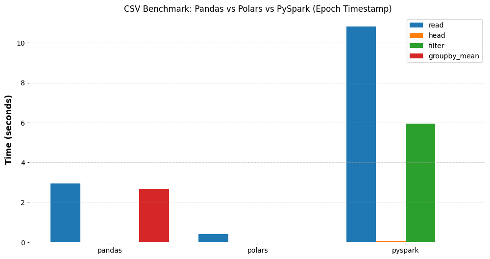

# Exploratory Data Analysis (EDA)

## Index
- [DataFrameLoader](#dataframeloader)
- [CryptoEDA](#cryptoeda)
- [CryptoFeatureEngineer](#cryptofeatureengineer)
- [CryptoDatasetLoader](#cryptodatasetloader)
- [Model Training](#model-training)
- [ModelEvaluator](#modelevaluator)
---
## Features

### DataFrameLoader

- Load CSV datasets into Pandas, Polars, or PySpark.
- Ensures Timestamp remains in epoch seconds for consistency.
- Benchmarks performance of basic operations (read, filter, groupby).
- Includes plots comparing speed across frameworks.

**Example Usage:**
```python
from Week2.Bitcoin_DataAnalysis import DataFrameLoader

csv_file_path = "btcusd_1-min_data.csv"
loader = DataFrameLoader(csv_file_path)

# Load as Pandas DataFrame
df_pd = loader.load('pandas')

# Load as Polars DataFrame
df_pl = loader.load('polars')

# Load as PySpark DataFrame
df_spark = loader.load('pyspark')
```

### Benchmarking

The notebook includes a benchmarking suite that compares the performance of Pandas, Polars, and PySpark for common data operations on the Bitcoin dataset:

- **CSV Read Time:** Measures how quickly each library loads the dataset.
- **Head Operation:** Time to fetch the first few rows.
- **Filtering:** Time to filter rows where Close price > 50,000.
- **GroupBy Mean:** Time to group by year and compute mean Close price.

Results are visualized as bar plots for each operation.  
**Findings:**  
For datasets of approximately 350MB, Polars and Pandas are significantly faster than PySpark, which incurs additional overhead due to its distributed nature. PySpark is recommended only for much larger datasets or distributed environments.

You can run the benchmark using:
```python
benchmark_results = loader.benchmark()
print("Benchmark results (in seconds):")
for lib, results in benchmark_results.items():
    print(lib, results)
```

### CryptoEDA

- Overview of dataset (shape, summary statistics).
- Price and volume trend plots.
- Returns calculation and distribution plots.
- Rolling volatility visualization.
- Correlation heatmaps of numerical features.
- Candlestick chart previews.
- One-click `run_all` method to execute all EDA steps.

**Example Usage:**
```python
from Week2.Bitcoin_DataAnalysis import CryptoEDA

# Load your Polars DataFrame (see DataFrameLoader above)
df = loader.load('polars')

# Initialize EDA
eda = CryptoEDA(df)

# Run all EDA steps (overview, plots, volatility, correlation, candlestick)
eda.run_all(recent_seconds=3600, vol_window=60, candlestick_rows=50)

# Or run individual steps
eda.overview()
eda.plot_price_trend()
eda.plot_volume_trend()
eda.add_returns()
eda.plot_returns_distribution()
eda.add_rolling_volatility(window=60)
eda.plot_rolling_volatility(window=60)
eda.plot_correlation_heatmap()
eda.plot_candlestick(last_n=50)
```

### CryptoFeatureEngineer

- Adds financial features for predictive modeling:
    - Returns, spreads, candle shapes
    - Lag features
    - Rolling statistics (SMA, EMA, volatility, ATR)
    - RSI, MACD, Bollinger Bands
- Returns a Polars DataFrame enriched with technical indicators.


**Example Usage:**
```python
from Week2.Bitcoin_DataAnalysis import CryptoFeatureEngineer

# Load your Polars DataFrame (see DataFrameLoader above)
df = loader.load('polars')

# Initialize feature engineer
fe = CryptoFeatureEngineer(df)

# Add features step-by-step or chain methods
df_feat = (
    fe.basic_features()
      .lag_features()
      .rolling_features()
      .rsi()
      .macd()
      .bollinger_bands()
      .get_df()
)

# View last few rows with new features
print(df_feat.tail(10).to_pandas())
```

### CryptoDatasetLoader

- Prepares features and target for machine learning:
    - Target = next-period Close price
    - Null handling and filtering
    - Optional scaling with StandardScaler
    - Optional PCA for dimensionality reduction
    - Train/test split support
    - Option to restrict to last N rows for experiments
    - PCA variance plots for diagnostics

**Example Usage:**
```python
from Week2.Bitcoin_DataAnalysis import CryptoDatasetLoader

# Use engineered features from CryptoFeatureEngineer
dataloader = CryptoDatasetLoader(
    df_feat,
    target_col="Close",
    scale=True,
    apply_pca=True,
    pca_variance=0.95,
    subset_size=100000   # only use last 100,000 rows
)

# Create target and filter nulls
dataloader.create_target().filter_nulls()

# Train/test split
X_train, X_test, y_train, y_test = dataloader.train_test_split()

# Visualize PCA explained variance
```

### Model Training

- Example with `RandomForestRegressor` using scikit-learn.
- Easily extensible to other ML models (XGBoost, LightGBM, Neural Nets).

**Example Usage:**
```python
from sklearn.ensemble import RandomForestRegressor

# Initialize the model
rf_model = RandomForestRegressor(
    n_estimators=100,    # number of trees
    max_depth=10,        # tree depth
    random_state=42,
    n_jobs=-1,           # use all CPU cores
    verbose=1            # minimal progress info
)

# Train the model
```
### ModelEvaluator

- Metrics: RMSE, R²
- Feature importance plots
- Residual analysis (residuals vs predicted, actual vs predicted)
- Residuals over time with timestamp alignment

**Example Usage:**
```python
from Week2.Bitcoin_DataAnalysis import ModelEvaluator

# Pass feature names from your dataset or PCA columns
feature_cols = [col for col in df_feat.columns if col not in ["Timestamp", "target"]]

evaluator = ModelEvaluator(
    model=rf_model,
    X_test=X_test,
    y_test=y_test,
    df=df,
    timestamp_col="Timestamp",
    feature_names=feature_cols
)

evaluator.predict()
evaluator.compute_metrics()
evaluator.plot_feature_importance(top_n=20)
evaluator.plot_residuals()
evaluator.plot_residuals_over_time()
```