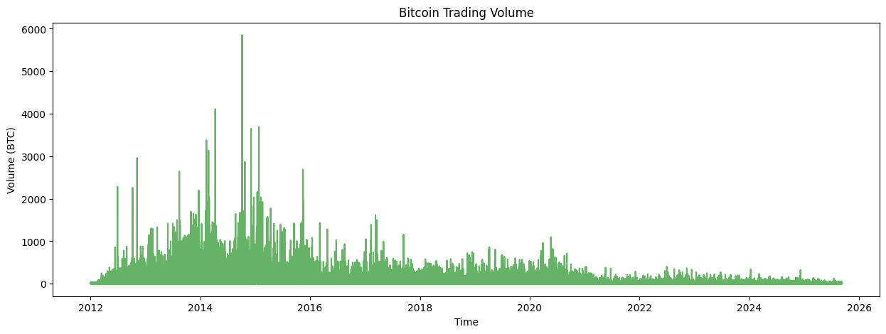
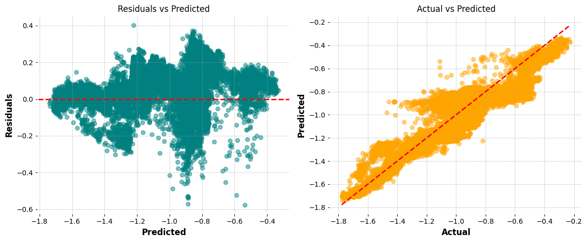

# Few Interesting Observations
#### Bitcoin Price Trend Insights

Over the past decade, Bitcoin has exhibited a remarkable and steady increase in price, punctuated by periods of high volatility and rapid growth. The long-term trend highlights Bitcoin's transition from a niche digital asset to a mainstream financial instrument, with notable surges during major adoption events and market cycles.

The chart below visualizes the historical price trend, showcasing the overall upward trajectory despite short-term fluctuations:

#### Bitcoin Volume Trend Insights

The historical volume trend for Bitcoin trading exhibits a bell-shaped curve, with notable peaks occurring between 2014 and 2017. This period corresponds to increased market activity and growing interest in cryptocurrencies, leading to higher trading volumes. After 2017, trading volume stabilized, reflecting Bitcoin's maturation as a financial asset.

The chart below illustrates the volume trend:

#### Recent Candle Trend Insights (Last 50 Candles)

Analysis of the last 50 candles provides a snapshot of short-term market sentiment and price action. Key observations include:

- **Bullish Candles:** Periods where the closing price is higher than the opening price, indicating upward momentum.
- **Bearish Candles:** Periods where the closing price is lower than the opening price, signaling downward movement.
- **Long Wicks:** Candles with long upper or lower shadows suggest volatility and potential reversals.
- **Doji Patterns:** Candles with small bodies and long wicks, reflecting market indecision.

The candlestick chart below visualizes the last 50 candles, highlighting recent price swings, volatility, and potential support/resistance levels:

## Results
The following plots summarize the model's performance on the test set:

**1. Predicted vs Actual Close Price**  
This plot compares the predicted Bitcoin closing prices from the trained model against the actual observed values. Points close to the diagonal indicate accurate predictions, while deviations highlight periods where the model struggled to capture market dynamics.

**2. Residuals Plot**  
The residuals plot visualizes the difference between predicted and actual closing prices over time. Patterns or clusters in the residuals may indicate areas where the model could be improved or where market behavior was particularly challenging to predict.

This combination of plots provides a quick visual check of model accuracy and highlights opportunities for further refinement.

---

## Improvements and Future Work

### Avoiding Data Leakage in Time Series Modeling

To ensure robust evaluation and prevent data leakage, it's crucial to respect the temporal order of observations. In time series systems, standard random splits can inadvertently allow future information to influence model training. Recommended strategies include:

- ✅ **Time-based Train/Test Split:** Always split data chronologically, ensuring that training data precedes test data in time.
- **Group K-Fold Cross-Validation:** For grouped time series (e.g., multiple assets), use group-aware cross-validation to avoid mixing data across groups.
- **Rolling Window Validation:** Employ walk-forward or expanding window validation to simulate real-world forecasting scenarios.

### Model Limitations and Future Directions

The current pipeline demonstrates strong performance for short-term Bitcoin price predictions (less than 1 day ahead). For longer-term forecasting, market dynamics become more complex and require advanced approaches:

- **Sequence Models:** Explore LSTM, GRU, or Transformer-based architectures to capture temporal dependencies.
- **Feature Enrichment:** Incorporate external factors (macro indicators, sentiment, blockchain metrics) for improved long-term accuracy.
- **Ensemble Methods:** Combine multiple models to enhance robustness and generalization.
- **Hyperparameter Optimization:** Systematically tune model parameters for optimal results.

Continued experimentation with these techniques will help extend the model's applicability to longer horizons and more challenging prediction tasks.

## Detailed Results and Visualizations

For detailed results, visualizations, and model evaluation, please refer to the notebook:  
[Bitcoin_DataAnalysis_Notebook.ipynb](./Bitcoin_DataAnalysis_Notebook.ipynb)

The notebook includes:
- Benchmark comparisons for Pandas, Polars, and PySpark
- Exploratory data analysis plots
- Feature engineering outputs
- Model training and evaluation metrics
- Residual and feature importance visualizations